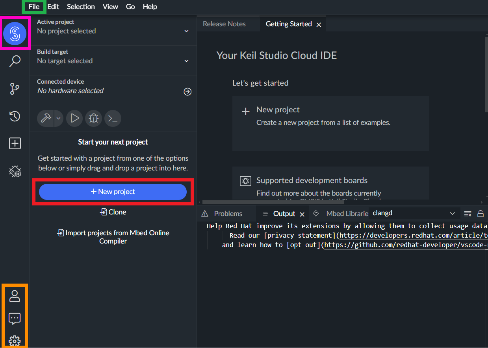
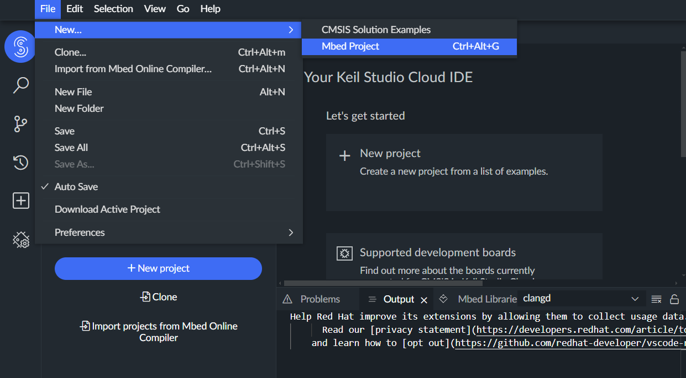
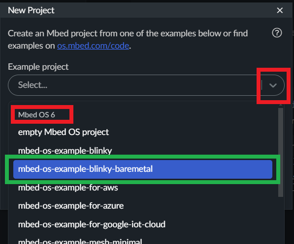
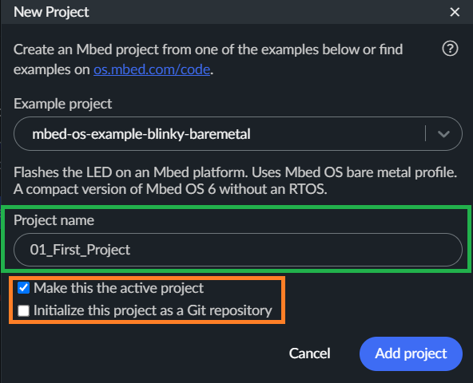
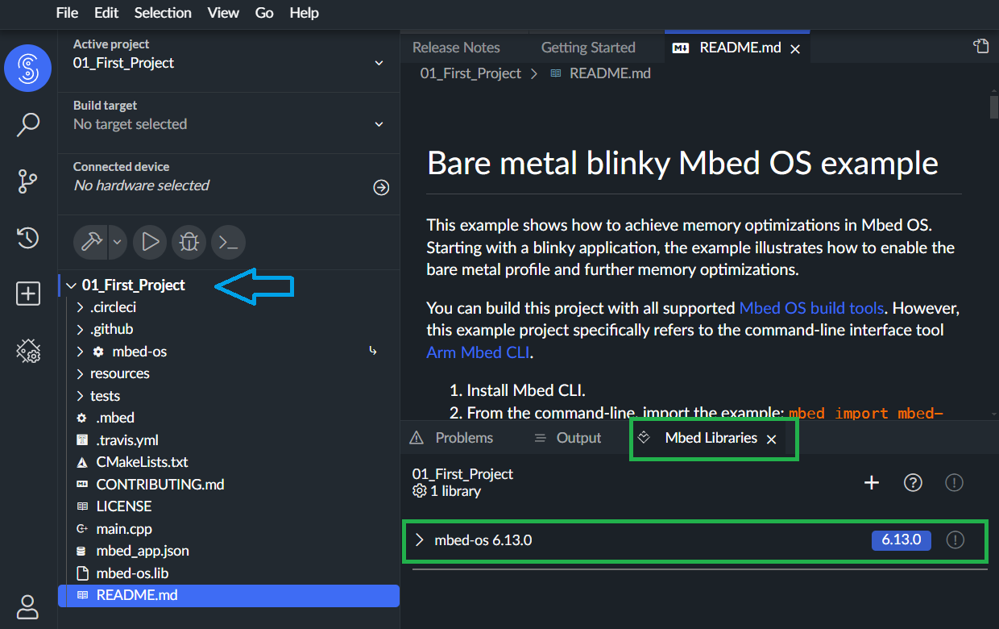
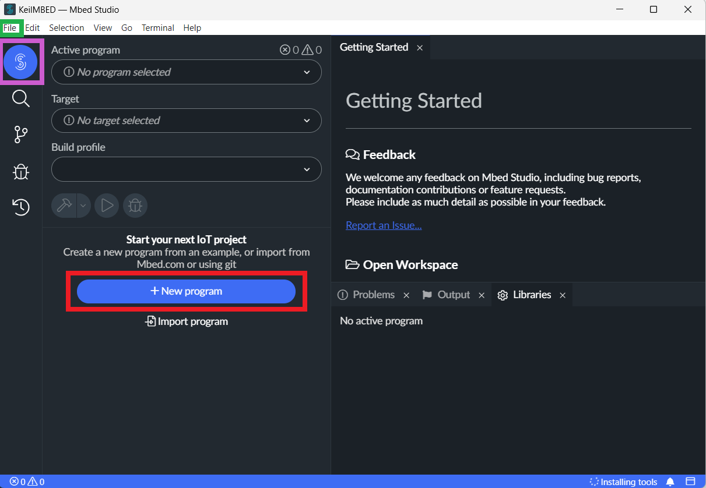

Creation of a MBED project
##########################

If you want to use MBED Studio, see :ref:`MBED Studio first project <mbed_studio_project>`.

Keil Studio Cloud
*****************

.. note::

	In this section, we assume that you have a MBED account or an Arm® account. See :ref:`Keil Studio Cloud account <keil_studio_cloud>`.

You can access to this platform by following this link: https://www.keil.arm.com/. 

.. figure:: ../_static/images/keil/keil_website.png
	:align: center	

Then click :menuselection:`Keil Studio Cloud`, to access to the login page. Log into the *Keil Studio Cloud* platform with your personal informations.

Keil Studio Cloud IDE
=====================

You will access to the main window of the :abbr:`IDE (Integrated Development Environment)`.

This interface is divided in a classical manner with a **project management** area (on the left side of the interface), a **text editor** area (in the top-right part of the interface) and an **output information** area (in the bottom-right part of the interface).

	Main window of the Keil Studio Cloud platform. https://www.keil.arm.com/

During your first access, no projects appear in the **project management** part. In this section, you can access to :

* your **personal informations** (icons surrounded by an **orange** border);
* the list of the projects you develop (icon surrounded by a **pink** border).

Create your first project
=========================

To create a new project, you can click :menuselection:`+ New Project` (icon surrounded by a **red** border on the previous figure) or click :menuselection:`File -> New... -> MBED Project`.

	:menuselection:`File -> New... -> MBED Project` in Keil Studio Cloud.

Then select :menuselection:`MBED6 -> mbed-os-example-blinky-baremetal`.

	
	New project selection. 
	
.. warning::

	To avoid any compilation conflicts with other libraries, make sure to select the **baremetal** project in the **MBED 6** version of *MBED-OS*.
	
When the type of project is selected, you can change the **project name**. Give a specific name corresponding to the content of the project.

You can uncheck the :menuselection:`Initialize this project as a Git repository` option if you are not using Git with your project.

Click :menuselection:`Add project`. Your first project is created. 

	
You can check in the :menuselection:`Libraries Manager` tab (in the bottom-right part of the interface) the version of MBED that it is used (in this example: MBED version 6.13).

|

Now it's time to test your first application, go to the :ref:`Blinky example explanations <mbed_blinky>` .

.. _mbed_studio_project:

MBED Studio
***********

.. note::

	In this section, we assume that you have a MBED account and that MBED Studio is installed on your computer. See :ref:`Keil Studio Cloud account <keil_studio_cloud>`.
	

Start :menuselection:`MBED Studio`.

MBED Studio IDE
===============

You will access to the main window of the :abbr:`IDE (Integrated Development Environment)`.

This interface is divided in a classical manner with a **project management** area (on the left side of the interface), a **text editor** area (in the top-right part of the interface) and an **output information** area (in the bottom-right part of the interface).

	Main window of the MBED Studio software.
	

During your first access, no projects appear in the **project management** part. In this section, you can access to the list of the projects you develop (icon surrounded by a **pink** border).

Create your first project
=========================

To create a new project, you can click :menuselection:`+ New Project` (icon surrounded by a **red** border on the previous figure) or click :menuselection:`File -> New Program`.

	:menuselection:`File -> New Program` in MBED Studio.

Then select :menuselection:`MBED6 -> mbed-os-example-blinky-baremetal`.

.. figure:: ../_static/images/keil/keil_mbed_studio_new_project_mbed_blinky.png
	:align: center
	:width: 70%
	
	New project selection. 
	
.. warning::

	To avoid any compilation conflicts with other libraries, make sure to select the **baremetal** project in the **MBED 6** version of *MBED-OS*.
	
When the type of project is selected, you can change the **project name**. Give a specific name corresponding to the content of the project.

	
	Add a new project in MBED Studio.

.. warning::

	In the **MBED OS Location** section, make sure to select the **Link to an existing shared Mbed OS instance** option, and select the directory where an instance of the last MBED-OS is installed.

	
.. note::
	
	On the LEnsE labwork computers, the last version of MBED-OS is installed in :file:`S:\\mbed-os` and :file:`C:\\mbed-os` .
	
Click :menuselection:`Add project`. Your first project is created. 

	
|

Now it's time to test your first application.

.. _mbed_blinky:

Blinky Baremetal Example
************************

Duplicate a project
*******************

Pre-compiler informations
*************************

