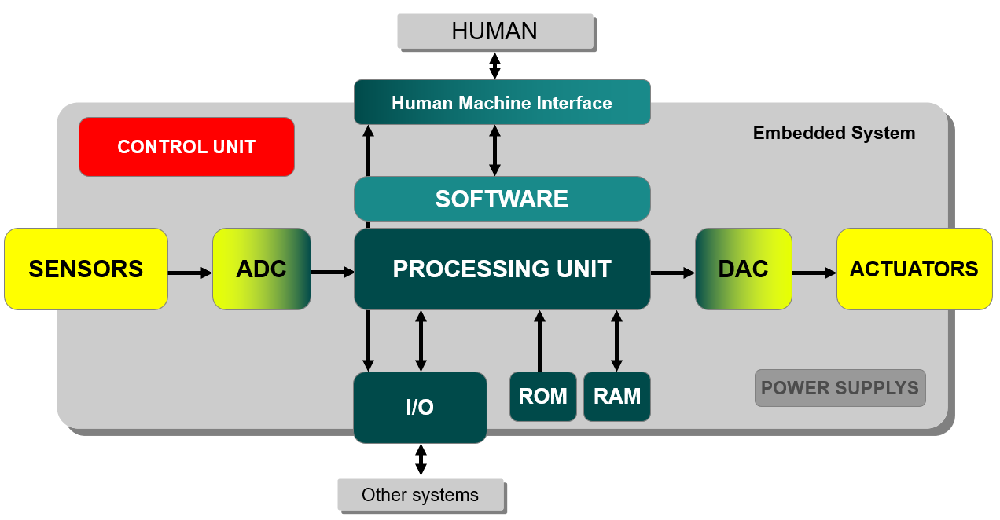

Embedded systems
################

.. toctree::
   :maxdepth: 1
   
	Microcontroller vs Processor<gen_microcontroller>
	Polling vs Interrupts<gen_polling_interrupts_rtos>

Embedded systems
****************

An **embedded system** is a combination of **hardware and software** designed for a specific function within a larger system. It typically includes one or more microcontrollers or microprocessors, along with other components like sensors, actuators, and communication interfaces.

	
	Structure of an embedded system.
